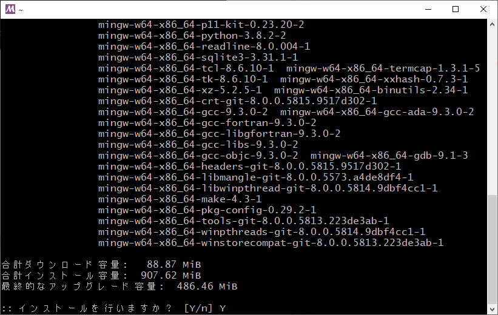

TangPrimer(RISC-V)をArduinoIDEでプログラム開発する


# はじめに

SipeedからTangPrimerというRISC-V対応の格安FPGA基板が売り出されています。日本では秋月電子(http://akizukidenshi.com/catalog/g/gM-14786/)やShigezone(https://www.shigezone.com/?product=tang-primer)などから2,000円くらいで入手する事ができます。さっそく飛びつくように購入しました。使い方に関してはSipeed社のTangPrimerに関するサイト(https://tang.sipeed.com/en/)にてFPGAへのVerilog記述論理合成書き込みまでは簡単に実行する事ができました。

しかし、目玉であるRISC-V(LicheeTang E203Core https://github.com/Lichee-Pi/Tang_E203_Mini)については、論理合成しFPGAへ書き込んだまでは良かったのですがRVデバッカを使用してFlashROMにソフトプログラムを書き込もうとしても、以下の様な不具合によって書く事が出来ませんでした。

- 購入したTangPrimerに実装されているFlashROMが、準備されていたOpenOCDに対応していない。デバイスIDエラーとなる。
- 準備されているE203_Miniプロジェクトを論理合成したバイナリファイルではOpenOCDが動作しない

 今回、OpenOCDの対策調査の過程で『TangPrimerをArduino IDEでプログラム開発する』方法を見つけました。Sipeed社の手順ではRISC-VプログラミングにはLinux環境が必要なのですが、Arduino IDE対応によって全ての作業がWindowsベースで行えます。Linux環境の準備が面倒な方には朗報(?)になると思いますので、私が行ったOpenOCDの対応方法と共に以下に紹介させて頂きます。

# 開発環境の準備

PCはWindows10を想定しています。基本的には[BigBitさんのブログ](https://blog.csdn.net/u013507936/article/details/86737964)に従っています。

記事の内容は以下の環境で行ってます。

- OS: Windows 10 64bit
- CPU: intel Core i5-8250U
- Memory: 8GB

TangPrimerとRVデバッガ、USBマイクロBケーブルを用意します。


写真にはUSBマイクロBケーブルは写ってません。また写真ではRVデバッガとPCを接続するUSB中継ケーブルを使用しています。

## Arduino IDEのインストール

ArduinnoIDEを入手しインストールします（詳細については割愛させて頂きます「Arduino インストール」等で検索してください）。私の環境では、Arduino IDE Ver.1.8.12を使用ししています。 

## RVデバッガドライバのインストール

RVデバッガドライバーをインストールします。ドライバは以下からダウンロードできます。

https://bigbits.oss-cn-qingdao.aliyuncs.com/Arduino_for_Licheetang_with_hbird_e203_mini/Driver/HBird_Driver.exe

RVデバッガをUSBポートに挿します。
ダウンロードした「HBird_Driver.exe」を実行します。

 

「次へ」を押します。

 

「完了」を押します。

 

上図のように、ドライバが二つインストールされていればOKです。

## Arduino IDEのボード設定

ArduinoIDEを起動してTangPrimer開発環境をインストールします。「ファイル」→「環境設定」→「追加のボードマネージャのURL」に下記のURLを追加します。

```
https://bigbits.oss-cn-qingdao.aliyuncs.com/Arduino_for_Licheetang_with_hbird_e203_mini/v0_1/package_licheetang_index.json
```


追加する際は、「,」（カンマ）で前のURL記述とつなぎます。

ボードマネージャにLicheeTang HBird E203 Boardをインストールします。「ツール」→「ボード」→「ボードマネージャ」（プルダウンメニューの上部）を選択すると下記のウィンドーが表示されるので、「LicheeTang」で検索


ここで、「LicheeTang・・・」が表示されないときは、前述の「追加のボードマネージャのURL」への記述に問題がありますので確認してください。

「LicheeTang HBird Board」を選択。「ツール」→「ボード」で表示されるプルダウンメニューから「LicheeTang HBird Board」を選択。

 書込装置に「LicheeTang OpenOCD」を選択。

 基本的には、ここまでの作業でTangPrimer(RISC-V)を開発出来るようになる筈です。

しかし残念ながらOpenOCDのエラーによりコンパイルは出来てもFlashROMへの書き込みが出来ませんでした。

**注意**

購入したTangPrimerのFPGAにはあらかじめRISC-V CPUが書き込まれております。もしTD(TangDynasty)で、RISC-Vプロジェクトの『Tang_E203_Mini』をダウンロードし論理合成しても、**作成されたバイナリはFPGAに書き込まないでください。RVデバッガでの書き込みが出来なくなってしまいます。**

もし書き換えてしまった場合は、以下のサイトのバイナリファイルをダウンロードしてTDで書き込んでください。現時点でOpenOCD(対策後)の動作が確認できたのは[こちらのファイル](https://dl.sipeed.com/TANG/Primer/SDK/LicheeTangNewIoMap_BitStream.bit)と、

こちらのTDプロジェクトパッケージが使用可能です。特にverilogHDLで機能拡張したい場合は、下記のパッケージをTDで機能追加・編集・コンパイル・書き込みが可能です。

[https://github.com/riktw/Tang_E203_Mini](https://github.com/riktw/Tang_E203_Mini)

また、Lichee-pi/Tang_E203_Miniを使用しても、下記の記載を修正すれば論理合成して、書き込み可能です。

project/e203egmini_new.sdc

```project/e203egmini_new.sdc
9行目 create_clock -name clk_16M -period 62.5 [get_nets {CLKIN}]
→ 削除 #create_clock -name clk_16M -period 62.5 [get_nets {CLKIN}]←コメントアウト
追加 create_clock -name clk_16M -period 62.5 [get_nets {clk_16M}]
　　　　　　　　　　　　　　　　　　　　　　　　　　　　　　　　　^^^^^^^^^
```


ただし、TDのバージョンは4.6.3以降をご使用ください。

以下手順にてOpenOCD対応方法を紹介させていただきますが、作り直したOpenOCDファイルを以下に保存しますので、手っ取り早くArduino IDEで動作させたい方は[こちら](https://github.com/Nanchite4618/LicheeTangOpenOCD)を使用してみてください。

ダウンロードしたら、「**ArduinoIDEのOpenOCDを置き換える**」の対応をしてください。

## LicheeTang OpenOCDのリビルド

デフォルトでインストールされているopenOCDは、現在入手可能なTangPrimerボードに実装されるFlashROM(XTX社製)に対応しておらずエラーとなりこのままでは書き込みができません。

このため、OpenOCDのソースをダウンロード、修正しリビルドする必要があります。

 先ずは開発環境となる、MSYS2(MinGW)をインストールし、この環境を整えるところから行います。

### MSYS2のインストール

以下のURLからMSYS2のインストーラをダウンロードして下さい。MSYS2のインストール初期設定は[Tech Blog](https://blogs.osdn.jp/2018/01/30/msys2-mingw.html)さんを参考にさせていただきました。

 http://www.msys2.org/

- 64bit環境→msys2-x86_64-xxxxxxxx.exe

- 32bit環境→msys2-i686-xxxxxxxx.exe

  (xxxxxxxxはたぶん日付)

 

それぞれ、インストーラを実行してMSYS2をインストールします。

私の環境は64bitなので、64bit版のmsys2-x86_64-xxxxxxxx.exeを実行しました。

実行し終わると、スタートメニューには以下のようにMSYS2下に３つのショートカットが出来上がります。64bit環境ではどれを使用しても問題ないようですが、私は64bit環境で作業を行いました。

 

「MSYS2 MinGW 64bit」を実行します。以下の様なシェルウィンドーが起動します。


まず、パッケージャの準備をしていきます。MSYS2には「ARCH Linux」由来のパッケージャ「pacman」が付属し、これを使用して色々なパッケージをインストールすることが出来ます。

始めに、パッケージデータベース一覧を最新のものにする処理を行います。

```bash
pacman -Sy
```


パッケージをアップグレードします

```bash
pacman -Su
```


「インストールを行いますか？」の問いに対して、「Y」を押してから「Enter」をおします。


 途中で止まり、「terminate MSYS2 without returning to shell and check for updates again for example close your terminal window instead of calling exit 」と表示されシェルに戻れない状態となった場合は、ウィンドー右上の「×」印をクリックし、ウィンドーを閉じて10秒程度待って下さい。「Processes are running insessiion:Close anuway?」というアラートウィンドーが表示されたら、「OK」をクリックして終了します。

そして、再度MSYS2を起動して、`pacman -Su`を実行します。

終了後、再度`pacman -Su`を実行し、「何も行うことがありません」と表示されることを確認します。


### GCCのインストール

インストールするパッケージは以下の通りです。

- mingw-w64-i686-toolchan : MinGWの32bit gccコンパイラ
- mingw-w64-x86_64-toolchan : MinGWの64bit gccコンパイラ

 これらのうちのどちらかです。ご使用の環境からお選びください。

 私は「mingw-w64-x86_64-gcc」を選択しましたが、上記toolchainでないとコンパイルできない例もありましたので、toolchainをインストールしてください。

パッケージのインストールには以下のコマンドを使用します。

```bash
pacman -S mingw-w64-x86_64-toolchain
```


このまま「Enter」キーを押すと下図のようになります。「Y」「Enter」を押します。



上図に対して「Y」「Enter」を押します（インストール容量多いので要注意）。


念のため、gccの動作を確認しておきましょう。

```
$ gcc --version
gcc.exe (Rev2, Built by MSYS2 project) 9.3.0
Copyright (C) 2019 Free Software Foundation, Inc.
This is free software; see the source for copying conditions.  There is NO
warranty; not even for MERCHANTABILITY or FITNESS FOR A PARTICULAR PURPOSE.
```

次に、libusbを導入します。コマンドラインから以下のコマンドを入力してください。このパッケージはopenOCD実行時に必要なライブラリを含んでいます。

```bash
pacman -S mingw-w64-x86_64-libusb
```


同じようにmake、autoconf、automakeも取ってきましょう。

```bash
pacman -S make autoconf automake
```
```bash
pacman -S libtool mingw-w64-x86_64-libftdi git
```
### OpenOCDのビルド

次に、openOCDのビルドを行います。コンパイラのバージョンが新しいせいか、途中でエラーが発生しますが、修正は簡単なので心配いりません。

私の場合は「/d/src/mk_openocd」を作成しました。

```bash
cd /d/src
mkdir mk_openocd
cd mk_openocd
```

この場所にワークディレクトリを作成した理由は、後の作業でエクスプローラでアクセスしやすい場所であるためです。

次にLicheeTang用のopenocdのソースをgithubから取ってきます。

```
git clone https://github.com/Lichee-Pi/LicheeTang_openocd.git
```


MSYS2ではgitが使用できるので以下のコマンドにより、ソース一式を取ってくることが出来ます。

重複しますが、この時にgitからファイルを受け取るディレクトリをWindowsのエクスプローラーから簡単に読める場所に展開することをお勧めします。要するに、「~/」の直下等は避けた方が良いということです。(ちなみにMSYS2の「~/」直下はWindowsから見ると、[MSYS64インストールフォルダ]/home/[ユーザ名]となります)


取得したソースのフォルダに移動します。

```bash
cd LicheeTang_openocd
```

以下、このフォルダで作業を行います。

configureスクリプトを作成するため、以下のコマンドを実行します。

``` bash
./bootstrap
```


終了すると、下記のメッセージが表示されます。


次に、Makefileを作成します。

``` bash
./configure --enable-ftdi
```

PCの処理能力にもよりますが、私のPCでは3~5分程度かかりました。ゆっくり待ちましょう。


最終的に上図の様な表示がなされ、シェルに戻ってきたら終了です。


XTX FlashROMのデバイスIDを追加する作業が必要です。

「LicheeTang_openocd/src/flash/nor/spi.c」を開き、86行目に以下を追加します。

``` c
FLASH_ID("xtx xt25f08",         0x20, 0xc7, 0x0014400b, 0x100, 0x1000, 0x100000),
```


これは、XTX FlashデバイスのデバイスIDや、各コマンド、セクタサイズ等が記されているものです。この行を追加することで、XTX Flashデバイスへの書き込みが可能となります。


ディレクトリはWindowsのエクスプローラからも見えますので、Windowsのエディタも使用可能です。


次にopenocdのコンパイルをします。コンパイルには以下のコマンドを入力します。

``` bash
make
```

これも非常に時間がかかるので、気長に待ちますが、途中エラーが発生してコンパイルが停止します。


早速エラーが出てコンパイルが停止しました。


「/d/src/mk_openocd/LicheeTang_openocd/src/jtag/drivers/libjaylink/libjaylink/../config.h」の83行目でマクロ「__USE_MINGW_ANSI_STDIO」が再定義されてますよ、という内容ですので、ファイルを開き、その部分を以下のように修正します。

``` c
/* 修正前 */
#define __USE_MINGW_ANSI_STDIO 1

/* 修正後 */
#ifndef __USE_MINGW_ANSI_STDIO
# define __USE_MINGW_ANSI_STDIO 1
#endif
```

修正・セーブしたら、再度「make」を実行します。

``` bash
make
```

暫くする再度コンパイルがエラーで停止します。


該当のファイル「LicheeTang_openocd/src/flash/mflash.c」をとりあえず開いてみましょう。エラーのあった1162行目を190→186に修正すればコンパイルは通るようになります。

``` c
/* 修正前 */
memset(pSegIdDrvInfo->reserved7, 0x00, 190);

/* 修正後 */
memset(pSegIdDrvInfo->reserved7, 0x00, 186);
```

この理由を少しお話しすると、単純にこの構造体の`reserved7`メンバのサイズが186Byteであるからです。宣言されているサイズ以上のデータを入れようとしていたため、エラーが発生しました。それにしても、このようなケースでエラー発生してバグを教えてくれる最近のgccはすごいですね。


では、コンパイルを再開します。

```bash
make
```

しかしまた、コンパイルエラーが出ます。


今度は、「src/flash/nor/psoc5lp.c」の237行目です。エラーメッセージ見ると、恐らく、NULL文字含めると3文字をコピーすることになるのですが、それを2文字しか指定されてないという意味になるかと思ってます（直訳は違います）。これを以下のように修正します。

``` c
/* 修正前 */
strncpy(str + 8, "xx", 2);

/* 修正後 */
strncpy(str + 8, "xx", 3);
```


コンパイルを再開します。

```bash
make
```

しかしまたまた、コンパイルエラーが出ます。


 今度は「src/target/riscv/riscv-011.c」の1800行目です。修正箇所は1687行目を以下のように修正します。

``` c
/* 修正前 */
unsigned int reg;

/* 修正後 */
unsigned int reg = 0;
```


変数「reg」が初期化されずに関数の引数として渡されているというのです。実際には直下のswitch文で色々な値が書き込まれていますが、default文に変数regへの載がないため、このようなエラーが発生したのでしょう。


では、先に進めます。

``` bash
make
```


このように、シェルに戻ってきたら終了です。

お疲れさまでした。

### ArduinoIDEのOpenOCDを置き換える

あとは出来上がったバイナリと「libusb-1.0.dll」をArduinoのopenocdが格納されているフォルダにコピーすれば作業は終了です。

フォルダは下記の場所にあります。

C:\Users\[ユーザ名]\AppData\Local\Arduino15\packages\licheetang\tools\openocd\a1\bin」

エクスプローラで上記フォルダに移動し、すでにある「openocd.exe」を適当な名前に変更します。上書きコピーでも問題ありませんが、念のため現在の「openocd.exe」を「org-openocd.exe」に名称変更しておきました。

先程ビルドした「openocd.exe」を上記フォルダにコピーします。新しくできた「openocd.exe」は、「LicheeTang_openocd/src」にあります。また、「libusb-1.0.dll」は「[MSYS2のインストールフォルダ]\mingw64\bin」にあります。

最終的にファイルは以下のようになります。

``` powershell
dir C:\Users\[ユーザ名]\AppData\Local\Arduino15\packages\licheetang\tools\openocd\a1\bin
2020/05/04  22:30    <DIR>          .
2020/05/04  22:30    <DIR>          ..
2020/04/30  13:52           210,014 libusb-1.0.dll
2018/12/28  20:55        20,197,142 org-openocd.exe
2020/04/30  13:52        22,955,827 openocd.exe
```


# Tang PriMERに書き込む

ArduinoIDEを使用してプログラムのコンパイル・書き込みを行います。

下図のように設定します。

- ボード → LicheeTang Hbird E203 Board
- 書込装置 → LicheeTangOpenOCD


私はソースをBigBitさんのサイトに書かれているものを利用させてもらいました（スケッチ例に記載されているソースは動作しませんでした）。 

コンパイル・書き込みも終了すると、画面は下図のようになり、カラーLEDが1秒間隔づつ赤、緑、青の順で点滅すれば完成です。

## TangPriMERのピンアサイン

Arduino IDEにおけるピンマップについては以下となります。（BigBitさんのサイトでは、一部記載ミスがありました）

LEDピンは出力動作、他各ピンの入出力動作が確認ができました。


# まとめ

一通り、ArduinoIDEを使ってのTangPrimer基板への書き込みが出来る状態にまでの工程を説明させてもらいました。正直なところ、ここまで来るのには簡単な道筋ではありませんでした。仲間がいなければ到底こんなことできなかったし、先ずしようとも思わなかったでしょう。この場をお借りしてお礼を申し上げます。

# 謝辞

参考にさせていただいたサイト皆様からの情報はとても有用で大変勉強になりました。

AutomakeやAutoconfの使用方法、MSYSでのパッケージ運用等この作業をする前は全く知りませんでした。また、何といってもBigBitさんのサイトに巡り合わなければ、この作業をすることもなかったでしょう。ありがとうございます。

また、重ね重ねになりますが、この作業の発端となったプロジェクトの立ち上げと勧誘、作業を文章で残そうと提案してもらったS氏、XTXのデバイスID関連の知恵を下さったW氏がいなければ、このような事になるには至らなかったでしょう。

本当に皆様ありがとうございます。


# 参考にしたWebサイト

Tang Primer Docs

- https://tang.sipeed.com/en/

 RISC-V低成本体验——使用Arduino开发蜂鸟E203程序

- https://blog.csdn.net/u013507936/article/details/86737964

 OpenOCD動作が確認できているFPGAバイナリファイル

- https://dl.sipeed.com/TANG/Primer/SDK/LicheeTangNewIoMap_BitStream.bit

 LicheeTang E203Core

- https://github.com/Lichee-Pi/Tang_E203_Mini 

HBird_Driver.exeのバイナリファイル

- https://bigbits.oss-cn-qingdao.aliyuncs.com/Arduino_for_Licheetang_with_hbird_e203_mini/Driver/HBird_Driver.exe 

 Arduinoの追加ボードマネージャのURL

- https://bigbits.oss-cn-qingdao.aliyuncs.com/Arduino_for_Licheetang_with_hbird_e203_mini/v0_1/package_licheetang_index.json

 MSYS2のインストール初期設定「Tech Blog」さんのURL

- https://blogs.osdn.jp/2018/01/30/msys2-mingw.html 

 MSYS2

- http://www.msys2.org/ 

 LicheeTang用のopenocdのソース

- https://github.com/Lichee-Pi/LicheeTang_openocd 

 Automakeでmakeする

- http://www.02.246.ne.jp/~torutk/cxx/automake/automake.html 

 Autotoolsを使ってプロジェクトのMakefileを生成する @kagemikuさん

- https://qiita.com/kagemiku/items/5aed05f7bd70d8035f54 

 LicheeTang_OpenOCDのソース

- https://github.com/Lichee-Pi/LicheeTang_openocd.git

 mingw-w64-x86_64-libusbライセンス調査

- https://repology.org/project/libusb/packages

easy labo LGPL調査

- http://easylabo.com/2015/04/rapid-prototyping/9048/

